<h1 align="center">New-Age-House </h1>

  
  

---

## 🌟 Giới thiệu

- Nhận diện khuôn mặt: Dùng OpenCV và Face Recognition để quét, mã hóa và so sánh khuôn mặt. Nếu trùng khớp, cho phép điều khiển thiết bị. Nếu không, sẽ không điều khiển được thiết bị.
- Nhận diện giọng nói: Dùng Speech Recognition để chuyển giọng nói thành văn bản, kiểm tra lệnh và gửi tín hiệu điều khiển qua Arduino.
- Sử dụng các cảm biến: Cảm biến mưa - đóng cửa sổ trời. Cảm biến hồng ngoại - bật/ tắt đèn và mở cửa ra vào. Cảm biến khí gas -  tia lửa
- Kết nối IoT:Arduino để sử dụng các cảm biến: khí gas, tia lửa, mưa, hồng ngoại.

---

## ⚙ Hệ thống

  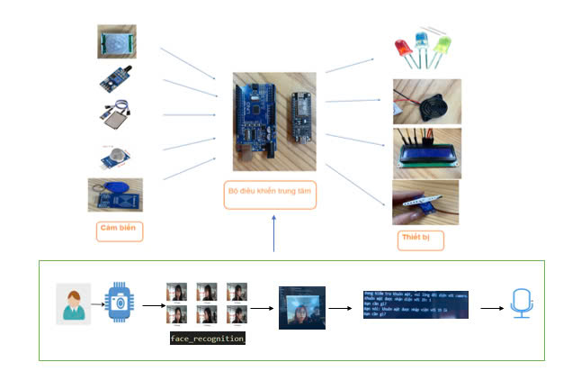

---
## 📂 Cấu trúc dự án

📦 Project

├── 📂bat_tat den ID

| ├──bat_tat_den_ID.ino     # Mã nguồn Arduino điều khiển các thiết bị.
| ├──huanluyen.py     # Huấn luyện id.
| ├──python face_voice_control.py   #  Nhận diện khuôn mặt.
| ├──voice_control.py    # Điều khiển bằng giọng nói.

├── cambienkhigass.rar
├── cambienmua.rar
├── cambientialua.rar
├── HongNgoai.rar

---
## 💻 Công nghệ sử dụng 
### Phần cứng

| **PHẦN CỨNG** | **SỬ DỤNG** |
|---------------------|-------------|
| Arduini           | Nhận tín hiệu điều khiển các thiết bị |
| Flame Sensor         | Cảm biến tia lửa         |
|  FM-20B         | Còi báo      |
|   LCD 1604       | Màn hình    |
|  PIR HC-SR501        | Cảm Biến Thân Nhiệt Chuyển Động      |
| relay 12VDC         | Cảm biến mưa       |
| Động cơ servo     | Động cơ điều khiển cửa |
| Metan MQ-4     | Cảm biến khí gas |
| Đèn Led       |           bật đèn cửa ra vào và bật đèn hệ thống trong nhà      |

### Phần mềm
| **PHẦN MỀM** | **SỬ DỤNG** |
|---------------------|-------------|
| PYTHON
| Arduino IDE| Để nạp file .ino|

###  Các thư viện Python cần thiết
Cài đặt các thư viện cần thiết:

    pip install opencv-python face-recognition SpeechRecognition
---
## 🧮 Bảng mạch

### 🔩 Kết nối phần cứng:
- bat_tat den ID
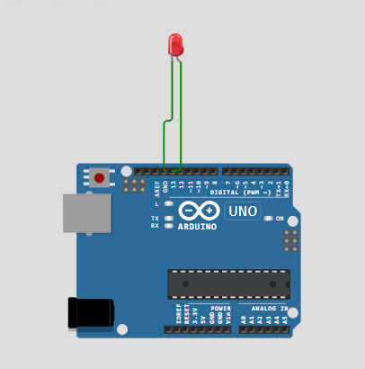
- cambienkhigass.rar
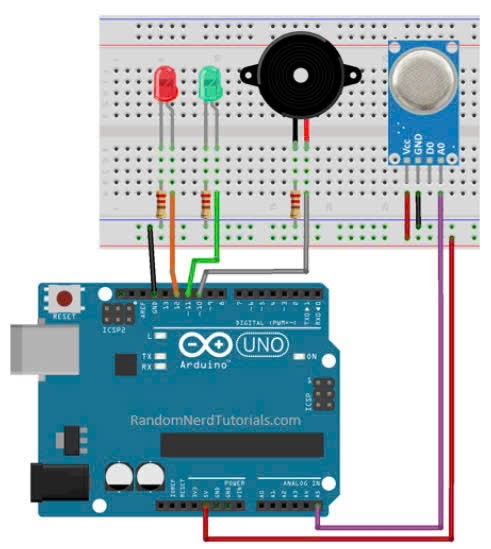
- cambienmua.rar
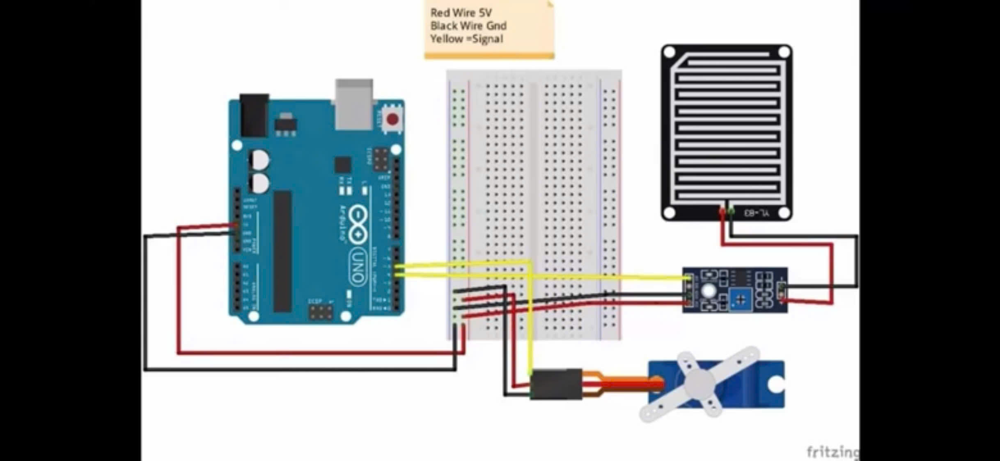
- cambientialua.rar
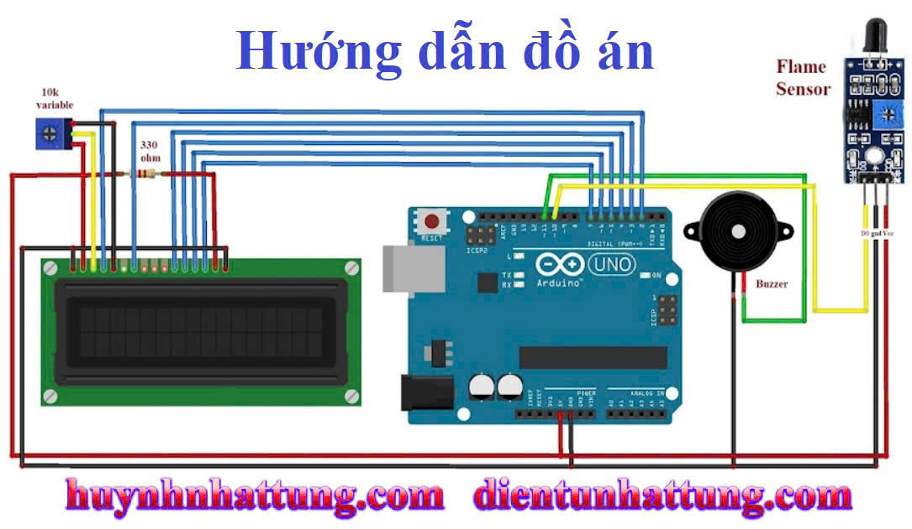
- HongNgoai.rar
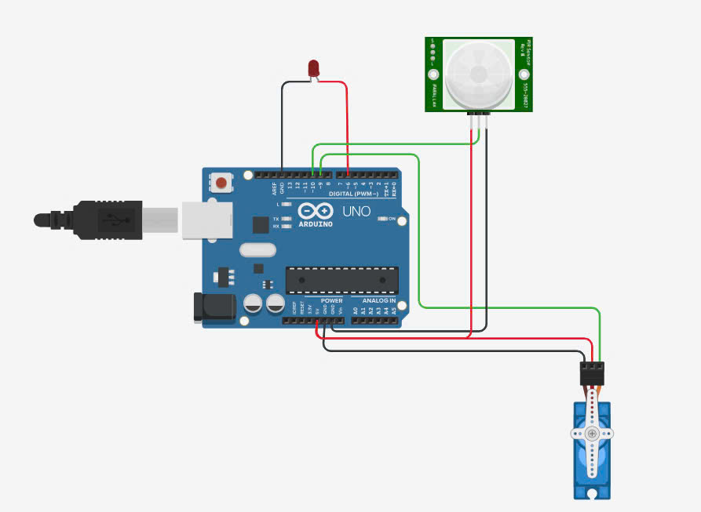

### ⛓️‍💥 Hướng dẫn cắm dây
- bat_tat den ID
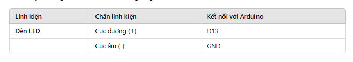
- cambienkhigass.rar
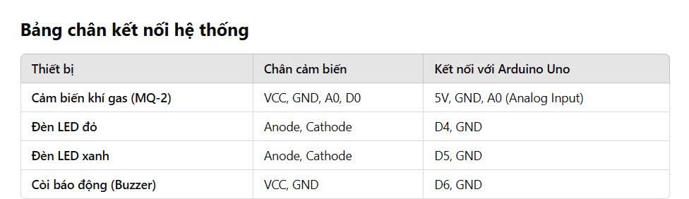
- cambienmua.rar
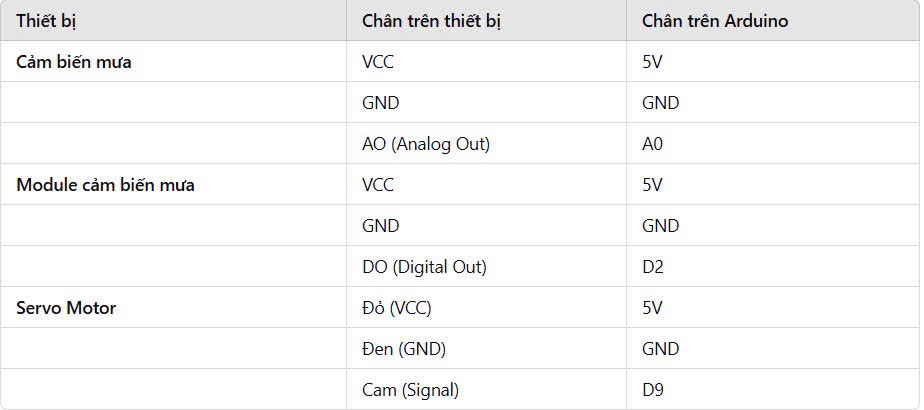
- cambientialua.rar
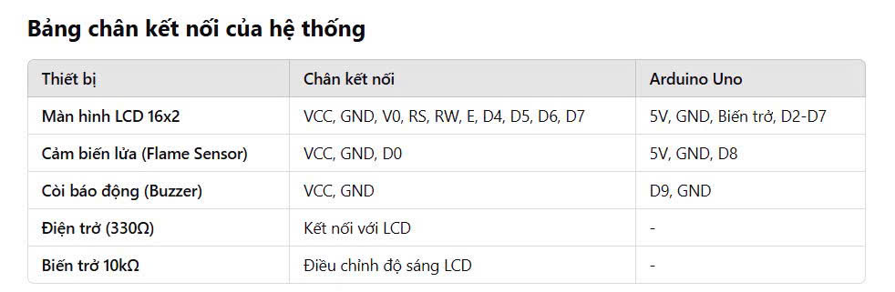
- HongNgoai.rar
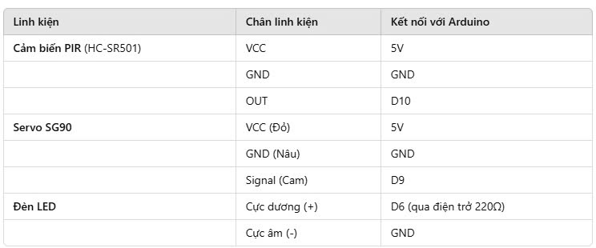
---
##🛠 Hướng Dẫn Cài Đặt Và Chạy

1️⃣ Cài Đặt Môi Trường
Cài đặt Python và thư viện cần thiết:
Yêu cầu: Python 3.8 trở lên

Cài đặt các thư viện cần thiết (chạy lệnh sau trong terminal/cmd):

        pip install opencv-python face-recognition SpeechRecognition pyserial

Cài đặt Arduino IDE:
Tải và cài đặt Arduino IDE từ Arduino

Cài đặt thư viện cho Arduino:

Mở Arduino IDE

Vào Sketch > Include Library > Manage Libraries

Tìm và cài đặt các thư viện cần thiết:

Servo (điều khiển cửa)

LiquidCrystal_I2C (hiển thị trên màn hình LCD)

SoftwareSerial (giao tiếp với module khác)

2️⃣ Kết nối phần cứng

Kết nối các cảm biến với Arduino:
Cảm biến khí gas (MQ-4) → Báo động khi phát hiện khí gas

Cảm biến mưa → Tự động đóng cửa sổ khi trời mưa

Cảm biến hồng ngoại (PIR HC-SR501) → Phát hiện chuyển động để bật/tắt đèn

Cảm biến tia lửa (Flame Sensor) → Phát hiện cháy để kích hoạt báo động

Động cơ servo → Mở/đóng cửa khi có nhận diện khuôn mặt

Loa báo động (FM-20B) → Còi báo khi có nguy hiểm

Màn hình LCD 1604 → Hiển thị trạng thái hệ thống

3️⃣ Chạy hệ thống

📌 3.1 Chạy Mã Nguồn Arduino
Mở Arduino IDE

Kết nối Arduino với máy tính qua cổng USB

Mở file bat_tat_den_ID.ino

Chọn Board: Arduino Uno (hoặc board phù hợp)

Chọn Cổng COM (tương ứng với Arduino)

Nhấn Upload để nạp code lên Arduino

📌 3.2 Chạy Nhận Diện Khuôn Mặt
1. Mở terminal/cmd trong thư mục chứa mã nguồn

2. Chạy lệnh sau để huấn luyện khuôn mặt:
  - Ví dụ:

        python huanluyen.py
      
3. Sau khi huấn luyện thành công, chạy nhận diện khuôn mặt:
 - Ví dụ:

        python face_voice_control.py

      
📌 3.3 Chạy Điều Khiển Giọng Nói
Đảm bảo micro hoạt động bình thường

Chạy lệnh sau:
 - Ví dụ:

        python voice_control.py

Nói các lệnh điều khiển như:

"Bật đèn "

--- 
## 📰 Poster

  

---
## 🤝 Đóng góp
Các thành viên nhóm

- Bùi Thị Ngọc Xương
- Phạm Văn Đạt
- Triệu Vũ Hà My
- Nguyễn Thành Phong

© 2025 NHÓM 5, CNTT16-06, TRƯỜNG ĐẠI HỌC ĐẠI NAM
